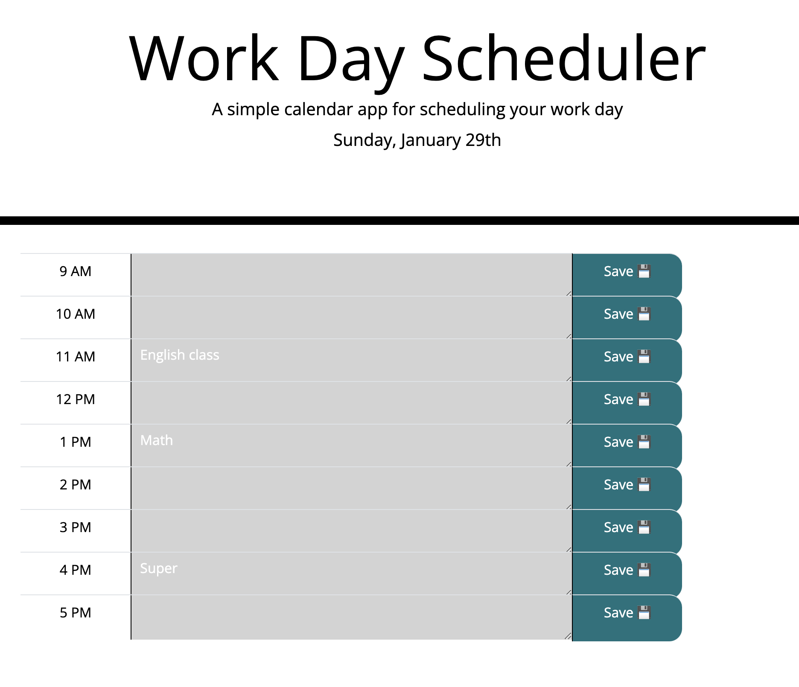

# Project-Tracker
This application is to create a simple calendar application that allows a user to save events for each hour of the day by modifying starter code. 

## Description
This application will run in the browser, which can dynamically updated HTML and CSS powered by JavaScript code. The Moment.js library is one of the major tool used in this application. 

## Main features
The Work Day Scheduler can add, edit and manage the tasks for the current day..
* The current day is dispalyed at the top of the calendar when the web application is launched.

* The calendar presents timeblocks for standard business hours.

* The timeblocks display different background-clor based on past, present, and future.

* The user can enter or edit an event when they click a timeblock.

* The event will be saved to local storage when the save button was clicked.

* The events only keep for the current date. The calendar will reset tomorrow.

## Deployment
Here are some screenshots of the application.

Click the link to test my webpage: https://xiaozhao1111.github.io/Project-Tracker/

## Contribution
Xiao Zhao, zhaoxiao20071106@gmail.com

## Community
It's open-source. Feel free to use it for learning purpose.